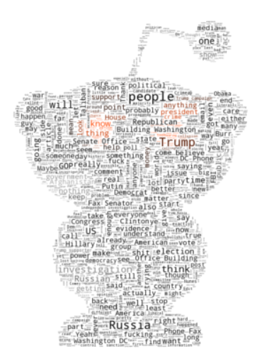
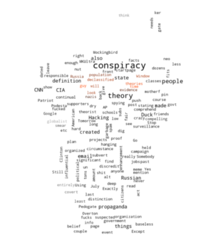

# Reddit PyCloud

This is our final project for CS2021 at University of Cincinnati written entirely in python. Accesses reddit API and displays comment/post data in a wordcloud format for subject analysis. Provided here is a framework. In order to use for yourself, see the **Installation** section below.

## 3rd Party Libraries Used

- PRAW
- wordcloud

See requirements.txt for more in-depth information.
Wordcloud includes several other third party libraries, such as numpy and matplotlib.

## Installation

Clone this repository to a directory of your choosing. Then create a virtual environment in which to install/run the third-party python libraries. This project requires python 3.x to be installed on the user's machine.

```
virtualenv env1
source env1/Scripts/activate

pip install praw
pip install wordcloud
```

It is important to note that an authentic reddit account is required for accessing the reddit API. As such, log into a valid reddit account and go to your user preferences, and navigate to the apps tab. Create an app and copy your API keys to *keys.py*.

Additionally, the project requires a DLL not found in the current version of Pillow (PIL), which is used to display the finalized word cloud. As such, you'll need to install a previous version.

To see if this affects you, try the following code in your python interpreter (make sure your virtual environment is activated):

```
from PIL import images
```

If this gives an ImportError, the following remedy will suffice.

```
pip uninstall pillow
pip install pillow==4.0.0
```

## Running the program

Simply run *main.py* and follow the prompts. Ensure that *snoo.png* is in the same directory as your code. If you wish, you can change that image to another for a different mask. Just be sure to change the corresponding lines in *feedBot.py*.

This may take a few seconds to complete. After all, it is parsing hundreds upon hundreds of comments, creating a text corpus, and then creating a visualization of said corpus.

## Reflection

This program has potential in data analysis with regards to social networking. Reddit is a unique place, and many of its users express unique opinions. It's interesting to see the contrast between different communities when it comes to subject matter. For instance, compare the wordcloud generated when searching the topic "Russia" on the politics subreddit vs. that generated from The_Donald. Those are shown below:





In the future, it can be possible to quantify these differences. Perhaps placing all the different wordclouds into one and color coding by user/subreddit origin.
